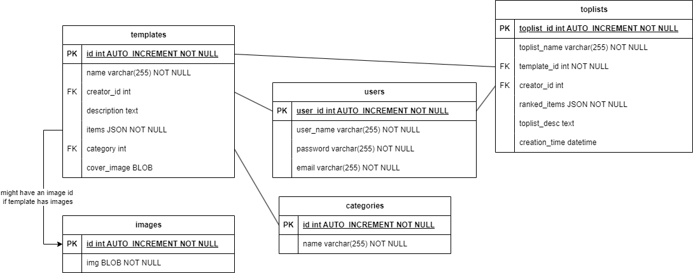

# LISTMAKER 9000

[](https://toplistmaker.onrender.com/)

Make your own top lists using existing templates or create your own template and compare your lists with other users!


## Why Listmaker?

Listmaker allows you to make templates and top lists easily and compare the results with other users. It also stores the date and time of top list creation, allowing you to use the same template again and compare how your own opinions have changed over time.

Top list creation mode also allows you to add a description, as well as item-specific notes, if you feel the need to explain your choices. It also allows you to add new items that weren't present in the original template, so you don't need to make a completely new one if the original creator of the template forgot to put something in there.

## How to use Listmaker 9000?

Go to [Listmaker 9000 website](https://toplistmaker.onrender.com/), find a template you like and start ranking! Or create an account and start making your own templates!

## Installation



If you want to clone Listmaker 9000 for your own use, clone this repository, create the necessary tables to your database and add following information to your .env file:

```
BASE_URL=
ORACLE_USER=
ORACLE_PASSWORD=
ORACLE_CONNSTR=
JWT_SECRET_KEY=
JWT_EXPIRES_IN=
ADMIN_USER=
```

Note that the Listmaker 9000 is done using Oracle DB.

Add .env.development to the frontend folder and add your API base URL: `VITE_API_URL=http://localhost:3000/api`

Go to root folder and run

```
npm install
npm start
```

Then register a user with the same username as what you wrote down to .env, that will be your admin user.

## Technologies


## Credits

Inspired by Tiermaker

## License

MIT © Sumu Vuori
