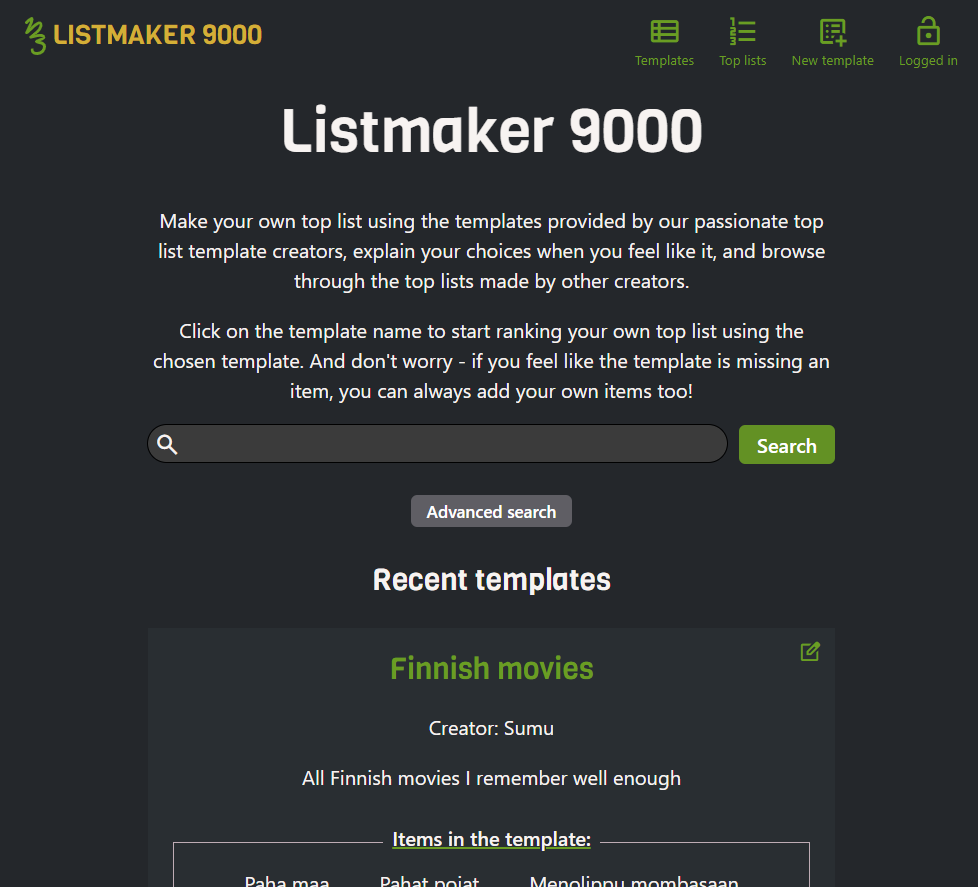
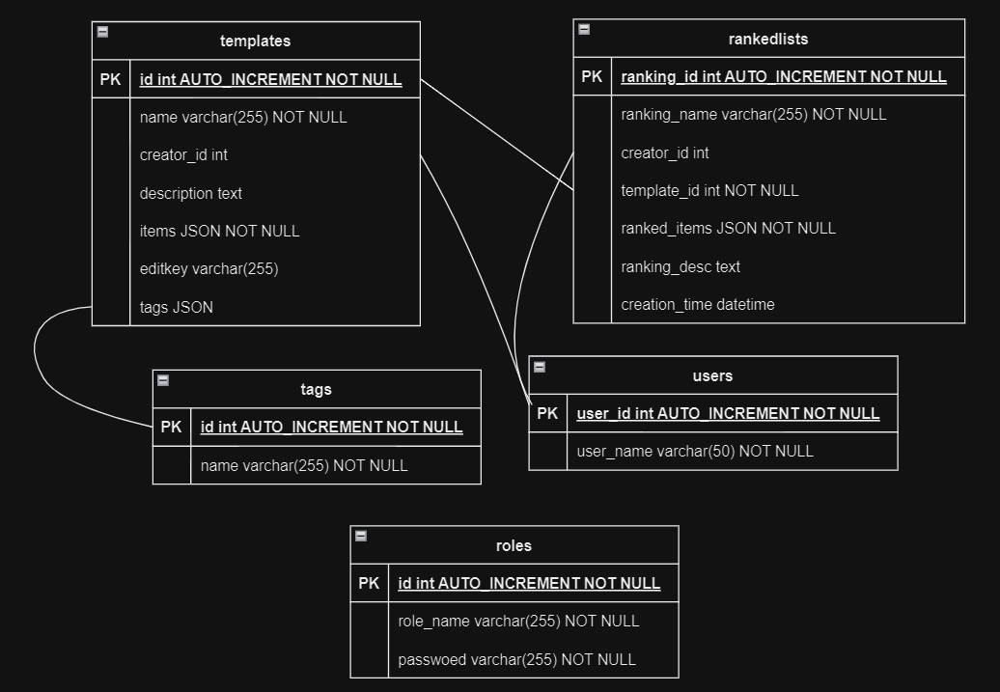

# LISTMAKER 9000

For making top lists from existing templates and comparing list rankings with other users.

[DEMO](https://toplistmaker.onrender.com/)
Creator account:
username: creator
password: rankingenjoyer420

[SCREENCAST](https://youtu.be/IN9492Vf_z4)



## About the project

I like ranking things and making lists, so I wanted to make an application where I could make templates and top lists easily, share them with friends, and store the date and time of creating the list.

## How to use Listmaker 9000?

Front page: On the front page of the application you'll see templates stored in the database. You can search for a specific template using the filter and sorting options.

Templates: The same view as the front page, but without the introduction text

Top lists: All top lists added by users, can be filtered in the same way as templates.

By clicking a name of a template you will be taken to a top list creation view, where you can make your own top list using the given template. When you save the list, you will be redirected to the URL of your new top list.

The last icon in the navigation bar is a login button. Log in with your admin or creator account, and you will also see a New Template link on the navigation bar.

New template: Build your own template and save it to the database

## Installation


Create necessary tables to your MySQL database and add .env file to backend folder with your MySQL credentials and base URL

```
MYSQL_HOST=
MYSQL_USER=
MYSQL_PASSWORD=
MYSQL_DATABASE
BASE_URL=http://localhost:3000
```

Add admin and/or creator roles to your database

```
INSERT INTO roles (role_name, password)
VALUES ("admin", PASSWORD('yourpassword'));

INSERT INTO roles (role_name, password)
VALUES ("creator", PASSWORD('yourpassword'));
```

Add .env.development to frontend folder and add your api base URL
`VITE_API_URL=http://localhost:3000/api`

Go to root folder and run

```
npm install
npm start
```

Enjoy!

## Credits

Inspired by [Tiermaker](https://tiermaker.com/)
ChatGPT used as a helping tool whenever I was stuck with unexpected errors and typos I couldn't notice, and whenever I felt like I need to understand better how a function works to properly use it.

## License

MIT © Sumu Vuori
